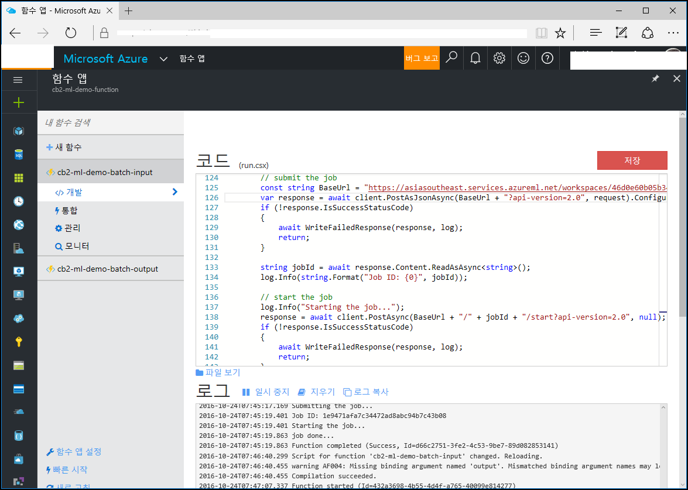
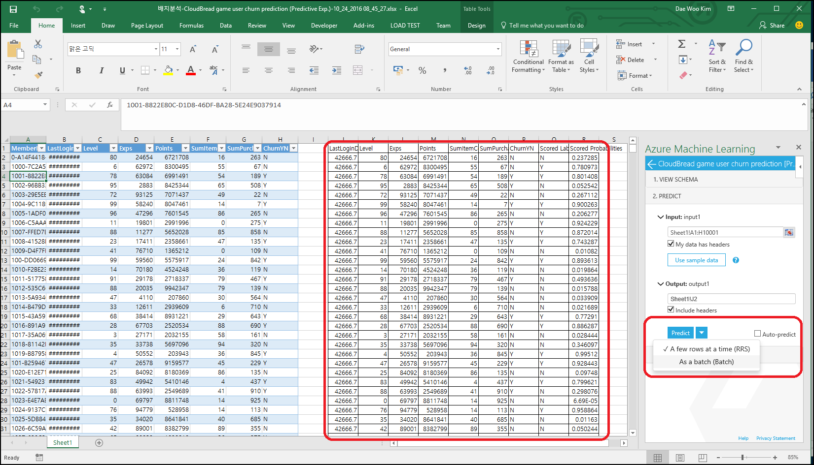

# SOSCON2016 - OSS 개발자의 Machine Learning 분투기

이 Repo는 SOSCON2016 - Machine Learning의 발표자료 Repo임
- SOSCON 2016 : http://www.soscon.net/  
- Session 정보 : http://www.soscon.net/session.do
- Short URL : http://aka.ms/soscon2016-ml
- Github URL : https://github.com/CloudBreadPaPa/soscon2016-ml  

사용되는 이미지 등은 디에스이트레이드 이성희 박사님, 강희재 소장님의 허락 하에 게시합니다.  

### Iris 데모 데이터
Iris 데모 데이터는 붓꽃 Lebel 데이터로 일반적인 분석 시나리오의 설명 등에 사용되는 예제 데이터임  


Iris 데이터 link : data 폴더 참조  

### Iris 모델 구축 데모
Iris 데이터에 대해 Multi-class 예측 모델 구축  
Azure ML Iris 모델 : https://gallery.cortanaintelligence.com/Experiment/d-party-bot-Iris-prediction-1  


### Bot Framework 데모
채팅봇을 이용해 다양한 채널 제공자와 채팅 가능  
https://aka.ms/dpartybot  

### NumPy 및 Pandas 셀프 스터디 - Jupyter 노트북
Jupyter 에서 즉시 실행가능  
PyData : https://github.com/wesm/pydata-book  

### Clustering 알고리즘 등의 R 코드 
Repo에서 제공하고 있는, r-script.r 파일을 R Studio에서 열고 실행 가능

### Azure Machine Learning을 활용한 prediction 모델
고객 이탈 예측 및 item 추천 예측 모델 데모로 사용한 링크 정보  
game user churn prediction : https://gallery.cortanaintelligence.com/Experiment/CloudBread-game-item-suggestion-prediction-1  
game item suggestion prediction : https://gallery.cortanaintelligence.com/Experiment/CloudBread-game-item-suggestion-prediction-1  


### Machine Learning algorithm
Machine Learning에서 데이터를 활용해 예측 분석 서비스가 가능하도록 학습시키기 위한 알고리듬 및 Machine Learning workflow 를 구현  

[고객이탈 예측(Game user churn prediction) real-time prediction & Batch prediction](https://gallery.cortanaintelligence.com/Experiment/CloudBread-game-user-churn-prediction-1)  

  

[게임내 아이템 추천(In-game item suggestion) real-time prediction & Batch prediction](https://gallery.cortanaintelligence.com/Experiment/CloudBread-game-item-suggestion-prediction-1)  

위의 모델은 모두 CloudBread 팀이 공개한 CloudBread Machine Learning의 예측 분석 모델  

**예측 분석 목표 정의 :  **  
위의 공개한 분석모델을 활용해 예측모델(Predict model)을 구축하고 API를 통해 실시간 예측을 수행하는 것이 목표.

- Machine Learning 모델을 생성하거나, 위의 gallery에서 복제  

-   

- 모델을 실행하고, 수행된 예측 결과 확인

-   

- Predictive model로 생성 후 API Web Service로 배포

-   

- 생성된 Web service의 API Key를 이용해 C# 코드에서 real-time predict 수행

    ```
    public class UserChurnController : ApiController  
    {
        // POST api/UserChurn
        public HttpResponseMessage POST(CBChurn p)
        {
            // Machine Learning 분석 요청
            InvokeRequestResponseService(p).Wait();
            ...
        }

        // Machine Learning Web Service 호출
        static async Task InvokeRequestResponseService(CBChurn p)
        {
            ...
            const string apiKey = "API키-수정"; // Replace this with the API key for the web service
            client.DefaultRequestHeaders.Authorization = new AuthenticationHeaderValue("Bearer", apiKey);
            client.BaseAddress = new Uri("Machine-Learning-Web-Service-URL-수정");
            HttpResponseMessage response = await client.PostAsJsonAsync("", scoreRequest).ConfigureAwait(false);
            if (response.IsSuccessStatusCode)
            {
                string result = await response.Content.ReadAsStringAsync();
                Debug.WriteLine("Result: {0}", result);
                p.ChurnYN = result;
            }
            ...
        }
    }
    ```

-   

- Machine Learning API Controller를 publish 하고, Postman에서 테스트 수행해 real-time prediction 수행

- Batch 작업을 수행하기 위해서 Machine Learning Batch execution이 제공하는 코드 이용이 가능.  

-   

- 추가적으로, Functions를 이용해 server-less로 batch 호출 역시 가능  

-   

- Excel을 이용해 Batch 분석도 가능  

- In-game에서 게이머의 패턴과 특성을 취합해 학습 시킨 후 적절한 유료 아이템을 추천하는 시나리오 역시 게임 서비스에서 매우 중요한 매출과 직결되는 예측 분석이며, 관련해 predict model로 *in-game item suggestion*을 제공  


### Python + Machine Learning 데모 코드
Azure Machine Learning이 노출하는 API를 Python에서 호출하는 예제 수행  

Iris 데이터를 호출해 RRE를 수행하는 예제  
python 폴더 하위의 ml-Iris.py 파일 참조  

```
import urllib2
# If you are using Python 3+, import urllib instead of urllib2

import json 


data =  {

        "Inputs": {

                "input1":
                {
                    "ColumnNames": ["Sepal.Length", "Sepal.Width", "Petal.Length", "Petal.Width", "Species"],
                    "Values": [ [ "0", "0", "0", "0", "" ], [ "1", "1", "1", "1", "" ], ]
                },        },
            "GlobalParameters": {
}
    }

body = str.encode(json.dumps(data))

url = 'https://asiasoutheast.services.azureml.net/workspaces/<ML-API-URL>'
api_key = '<API-KEY>' # Replace this with the API key for the web service
headers = {'Content-Type':'application/json', 'Authorization':('Bearer '+ api_key)}

req = urllib2.Request(url, body, headers) 

try:
    response = urllib2.urlopen(req)

    # If you are using Python 3+, replace urllib2 with urllib.request in the above code:
    # req = urllib.request.Request(url, body, headers) 
    # response = urllib.request.urlopen(req)

    result = response.read()
    print(result) 
except urllib2.HTTPError, error:
    print("The request failed with status code: " + str(error.code))

    # Print the headers - they include the requert ID and the timestamp, which are useful for debugging the failure
    print(error.info())

    print(json.loads(error.read()))                 

```

User Churn Predition을 수행하는 RRE를 수행하는 예제  
python 폴더 하위의 ml-user-churn.py 파일 참조  

```
import urllib2
# If you are using Python 3+, import urllib instead of urllib2

import json 


data =  {

        "Inputs": {

                "input1":
                {
                    "ColumnNames": ["MemberID", "LastLoginDT", "Level", "Exps", "Points", "SumItemCount", "SumPurchasePrice", "ChurnYN"],
                    "Values": [ [ "value", "value", "0", "0", "0", "0", "0", "value" ], [ "value", "value", "0", "0", "0", "0", "0", "value" ], ]
                },        },
            "GlobalParameters": {
}
    }

body = str.encode(json.dumps(data))

url = 'https://asiasoutheast.services.azureml.net/workspaces/<ML-API-URL>'
api_key = '<API-KEY>' # Replace this with the API key for the web service
headers = {'Content-Type':'application/json', 'Authorization':('Bearer '+ api_key)}

req = urllib2.Request(url, body, headers) 

try:
    response = urllib2.urlopen(req)

    # If you are using Python 3+, replace urllib2 with urllib.request in the above code:
    # req = urllib.request.Request(url, body, headers) 
    # response = urllib.request.urlopen(req)

    result = response.read()
    print(result) 
except urllib2.HTTPError, error:
    print("The request failed with status code: " + str(error.code))

    # Print the headers - they include the requert ID and the timestamp, which are useful for debugging the failure
    print(error.info())

    print(json.loads(error.read()))                 

```

EOF